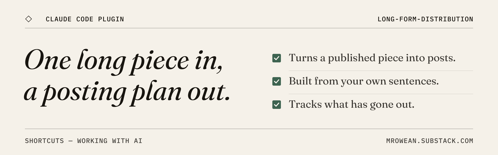
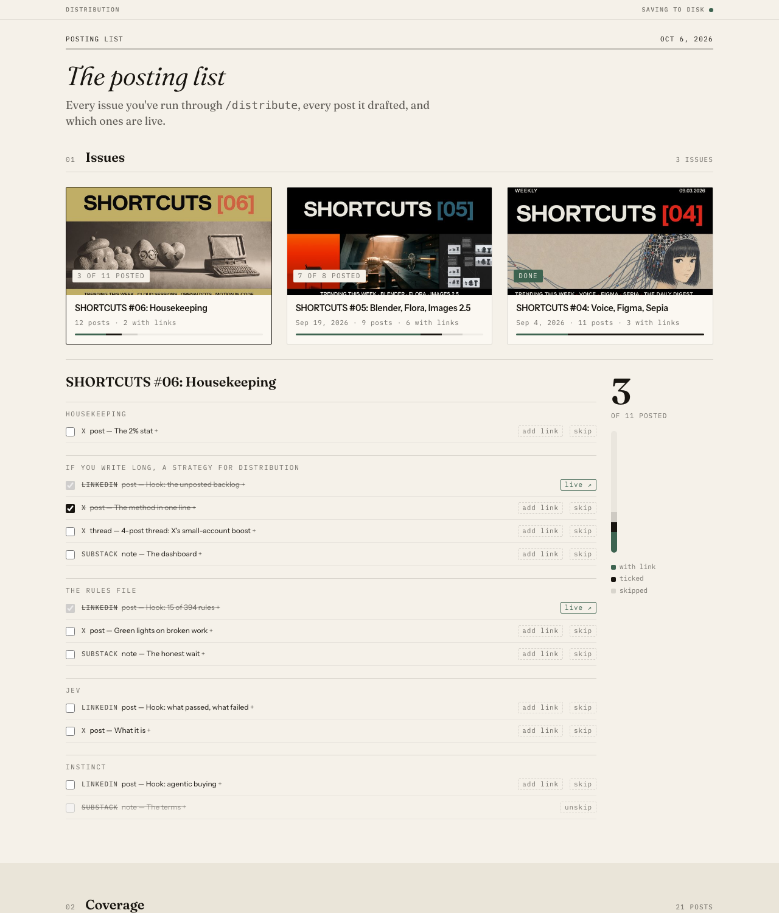

You wrote the long piece. It went out once, to your subscribers, and then it stopped working.

This is a Claude Code plugin that makes the rest of the piece go to work. You give it a published URL. It does two things:

1. It reads the piece, splits it into sections and writes LinkedIn, X and Substack Notes posts **out of your own sentences**. There's no generic AI voice, and every claim traces back to something you wrote.
2. It puts those posts on a **posting list**, a small dashboard that runs on your machine. You copy each post, tick it off when it's live and paste the link. Over time it shows you which sections you wrote and never posted.



## Install

You need [Claude Code](https://claude.com/claude-code) and Python 3.8 or newer, which is already on macOS and most Linux machines.

```bash
claude plugin marketplace add mrowean/long-form-distribution
```

```bash
claude plugin install long-form-distribution@long-form-distribution
```

Or, inside a Claude Code session:

```
/plugin marketplace add mrowean/long-form-distribution
/plugin install long-form-distribution@long-form-distribution
```

## Use

```
/long-form-distribution:distribute https://yourname.substack.com/p/your-latest-issue
```

Claude reads the piece and shows you its sections in a table, then waits while you pick which ones to post and where. Then it writes the posts, saves the issue and starts the dashboard at `http://127.0.0.1:8799`.

To open the dashboard later without distributing anything new:

```
/long-form-distribution:distribute dashboard
```

## Try it first

You can see the dashboard with three sample issues before you install anything:

```bash
git clone https://github.com/mrowean/long-form-distribution
```

```bash
python3 long-form-distribution/skills/distribute/dashboard/serve.py --demo
```

Open `http://127.0.0.1:8799`. The samples are real issues: SHORTCUTS #04, #05 and #06, the one where I wrote about this tool. Every post in them is cut from that issue's own sentences. In demo mode nothing is saved. You can also open `skills/distribute/dashboard/index.html` straight from disk. It shows the same samples, and your ticks stay in that browser.

To see the quote check on the same sample:

```bash
python3 long-form-distribution/skills/distribute/scripts/check_posts.py --source long-form-distribution/skills/distribute/sample/sources/sample-shortcuts-06.txt --posts long-form-distribution/skills/distribute/sample/issues/sample-shortcuts-06.json
```

The source file holds the passages of the issue that the sample posts are cut from.

## Where your data lives

Everything stays on your computer. Claude fetches the article URL you give it; nothing else is sent anywhere. The server only listens on 127.0.0.1 and only answers requests made from its own page.

```
~/distribution-tracker/
  issues/<slug>.json   one per issue: its sections and the drafted posts
  sources/<slug>.txt   the piece's text, which every post is checked against
  log.jsonl            every tick, skip and posted link, appended in order
  covers/<file>        optional: cover images, if you'd rather not link to the web
  voice.md             optional: your own best posts, for matching your social voice
```

Set `LFD_HOME` to keep it somewhere else, e.g. a synced folder. The files are plain JSON, so you can read them, edit them or delete them. **Export CSV** on the dashboard downloads every posted link as a spreadsheet.

## How the posts get written

The skill's rules are in [`skills/distribute/SKILL.md`](https://github.com/mrowean/long-form-distribution/blob/main/skills/distribute/SKILL.md). The short version:

- **Your sentences, fitted to the format.** The key line in each post is quoted or trimmed from the piece. Lead-ins and rewording are there to fit the platform, not to add claims.
- **Nothing made up.** No numbers, quotes or results that aren't in the piece.
- **Checked, not trusted.** A script compares every post with the piece. It shows which lines are quoted, which are reworded (next to the sentence they came from) and which are new lead-ins, and it flags any number, quote or name that isn't in the piece, plus any post over its platform's length limit.
- **A different opening move per platform**, so people who follow you in two places don't see the same post twice.
- **A pass for the usual AI tells** before you see anything.
- **You pick the sections.** You know which parts you're proud of. It shows you the table and waits for your choice.

If you want the posts to sound more like your social writing than your long-form, give it 5–10 of your own posts that did well. It saves them as a voice file and reads that file every time.

## What this is, and what it isn't

This is the core of the system I use to distribute my own newsletter, with the parts that are specific to me taken out. My version also does these things, and none of them are included here:

- publishes the posts to a shared doc
- pulls engagement numbers back in
- runs a voice calibration over scraped post history

What's here is the core: drafting from the piece itself, and a list that makes the unposted sections visible.

The idea of treating one long piece as the source for a week of posts owes a lot to Dan Koe's writing on content systems and his content-strategist skills.

## License

MIT
